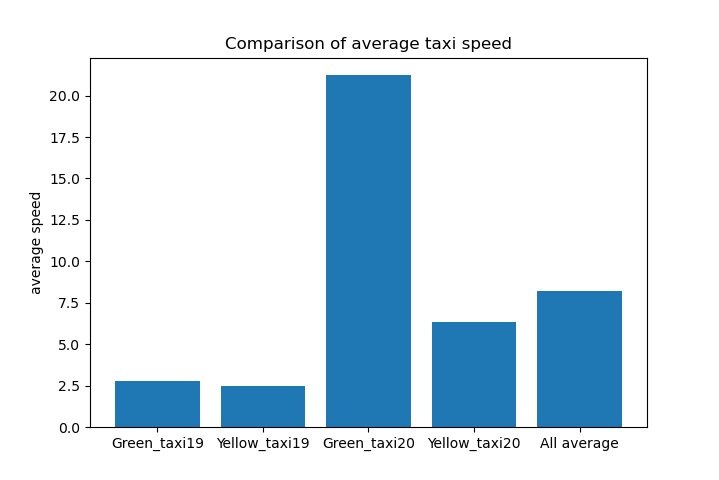

# ASEIED
Projekt ASEIED


# Sprawozdanie

## Zadanie polegało na przedstawianiu średniej prędkości taksówek w Nowym Yorku w podanym przedziale czasowym.

Do obsługi i realizacji programu użyliśmy Amazon Web Services, gdzie utworzyliśmy "cluster" danych, a same dane, zapisane w pliku .csv umieściliśmy w "buckecie"
o nazwie aseieddata.

Program obsługiwany był jednym plikiem głównym "main.py", który wczytywał cztery pliki .csv z serwera a następnie wykonywał na nich obliczenia.
Dzięki zastosowaniu obiektów DataFrame i przy użyciu modułu PySpark mogliśmy swobodnie korzystać z danych przy pomocy poleceń języka SQL.

````
responses_y20 = dataFrameReader \
        .option("header", "true") \
        .option("inferSchema", value = True) \
        .csv("s3n://aseieddata/yellow_tripdata_2020-05.csv")  
````    

Następnie zaznaczaliśmy potrzebne kolumny i wykonywaliśmy odpowiednie obliczenia tj. wyliczanie czasu podróży, a następnie podzielenie odległości przez obliczony czas, by ostatecznie wziąć średnią z kolumny.

````
g19_time = responses_g19.select((func.unix_timestamp("lpep_dropoff_datetime") - func.unix_timestamp("lpep_pickup_datetime")), "trip_distance")
g19_time = g19_time.select(func.col("(unix_timestamp(lpep_dropoff_datetime, yyyy-MM-dd HH:mm:ss) - unix_timestamp(lpep_pickup_datetime, yyyy-MM-dd HH:mm:ss))").cast("int").alias("time"), func.col("trip_distance").cast("int").alias("trip_distance"))
g19_avg = g19_time.select(func.avg((1000 * func.col("trip_distance")) / func.col("time")))
````

Ostatecznie łączymy wszystkie prędkości średnie odpowiednich danych w jeden DataFrame i zapisujemy go do nowego pliku .csv w podanym wyżej buckecie.

````
g19_avg.write.format("csv").save("s3n://aseieddata/avg")
````

## Opracowanie otrzymanych wyników

Wyniki ukazują podobne wyniki dla zielonych jak i żółtych taksówek w maju 2019 roku.
Duża różnica pojawia się w maju 2020 roku, w którym to zauważymy znaczną różnicę w średniej prędkości taksówki zielonej w porównaniu do żółtej.
Być może było to związane z wybuchem pandemii i globalnym obniżeniem ruchu drogowego.

Mimo to, wyniki jakie otrzymaliśmy są prawdopodobne i oczekiwane.



## Napotkane problemy

Podczas wykonywania zadania 2 nie napotkaliśmy poważnych problemów. To co wydało się najtrudniejsze to sposób w jaki powinniśmy obliczyć czas na podstawie danych, jednak to było dosyć proste i po krótkim czytaniu dokumentacji udało nam się zrealizować wymagane zadanie.

Niestety, oryginalnie mieliśmy wykonywać zadanie 1, z którego jednak musieliśmy zrezygnować, przez niedostępność danych.
Dane, z których mieliśmy tam korzystać były w dziwnym formacie 'WARC', co do którego było bardzo mało objaśnień jak i pomocy na forach internetowych.
Mimo, iż udało nam się uzyskać te dane przez platformę AWS to jednak nie byliśmy w stanie wyciągnąć z tych plików danych niezbędnych do wykonania zadania.
